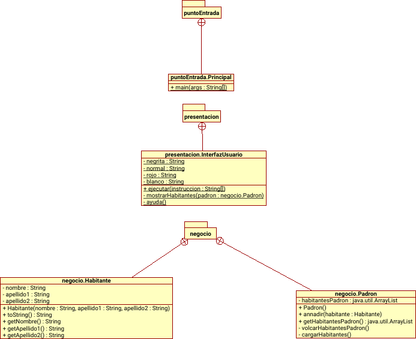

# Tienda Camisetas
Este programa está creado con el propósito de funcionar como un catálogo, en el que el usuario pueda incluir y poder ver impreso por pantalla las camisetas que este haya añadido, teniendo estos diversos atributos.
## Instalación:
Para instalar el programa debe escribir `make jar`
## Ejecución:
Para ejecutar debe escribir `java -jar aplicacionCamisetas.jar añadir <marca><color><talla>`

Por ejemplo: `java -jar aplicacionCamisetas.jar añadir nike roja M`
## Suprime los directorios bin y html, elimina los ficheros .jar, los .class y .txt.
`make limpiar`
## Crea el directorio bin y almacena los .class que ha compilado durante la ejecucion del make:
`make compilar`
## Crea el jar
`make jar`
## Generación del html:
`make javadoc`
## Estructura interna de la aplicación:
### La aplicación esta estructurada en 2 partes: negocio y presentacion
En el package negocio se encuentra la clase Tienda, la cual se encarga de gestionar la información de camisetas de una tienda. También se encuentra la clase Camiseta que representa un objeto de camiseta.

En el package presentacion se encuentra la clase pública interfazUsuario que es la clase principal que contiene la lógica para interactuar con el programa.

## Licencia
**Copyright** [2023] [Jaime Berlanga Comas]

Proyecto licenciado bajo la [Licencia apache 2.0]. Consulte el  archivo [LICENSE](LICENSE.txt) para obtener más detalles.
